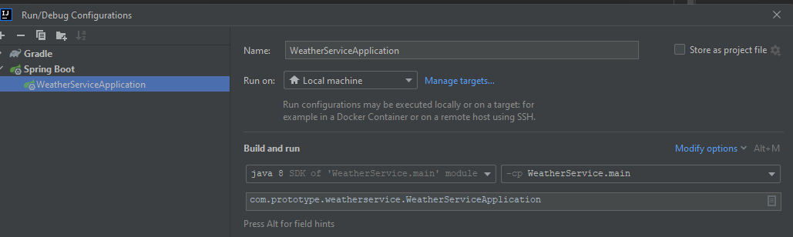

# WeatherService

WeatherService

Just a weather service with an API.

To add or remove a new city, you need to change cities.json

Features:

- Periodic collection and averaging of temperature data in cities using three free weather services;
- REST Endpoint API.

API:

```
API URL: http://localhost:8080/api/weather/v1/?
city=<city>
& [country=<country>]
& [date=<date>]
```

`city` - City name from `cities.json` config. Required field.

`country` - Country name from `cities.json` config. For cases when you need to specify the country of the city. Optional
field.

`date` - Get all weather data by date. Format: `yyyy-MM-dd`. If `date` is not set, the last known value for the city is
returned (like "temperature now"). Optional field.

Example API Request and Response:

#1. http://localhost:8080/api/weather/v1/?city=Moscow
<details>
<summary>Json Response #1</summary>
{
  "country": "Russia",
  "timestamp": 1660207837000,
  "name": "Moscow",
  "temp": 23
}
</details>

#2. http://localhost:8080/api/weather/v1/?city=Moscow&date=2022-08-03
<details>
<summary>Json Response #2</summary>
[
  {
    "country": "Russia",
    "timestamp": 1659518740000,
    "name": "Moscow",
    "temp": 27
  },
  {
    "country": "Russia",
    "timestamp": 1659519220000,
    "name": "Moscow",
    "temp": 27
  },
  {
    "country": "Russia",
    "timestamp": 1659526420000,
    "name": "Moscow",
    "temp": 27
  }
]
</details>

HOW TO RUN:

1. Clone this project;
2. Open/Import project in IDEA;
3. Create 'weatherservice' MySQL database for runtime;
4. Create 'weatherservicetest' MySQL database for test;
5. Select 'WeatherServiceApplication' in Run/Debug Configurations and run.

If your IDEA didn't generate it on its own when importing the project create SpringBoot run configuration manually:

`com.prototype.weatherservice.WeatherServiceApplication`

EDIT DATABASE SETTINGS:

You can change the data to connect to the database:

1. Runtime in application.properties
2. Test in application-test.properties
   